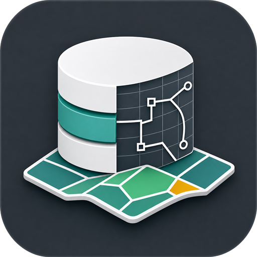
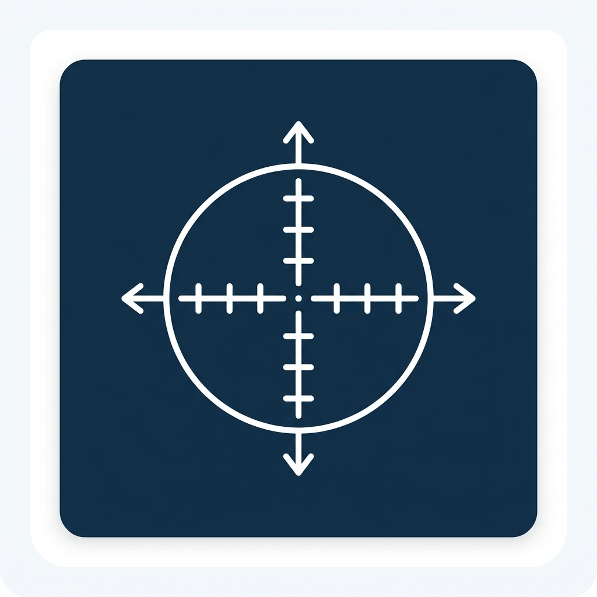
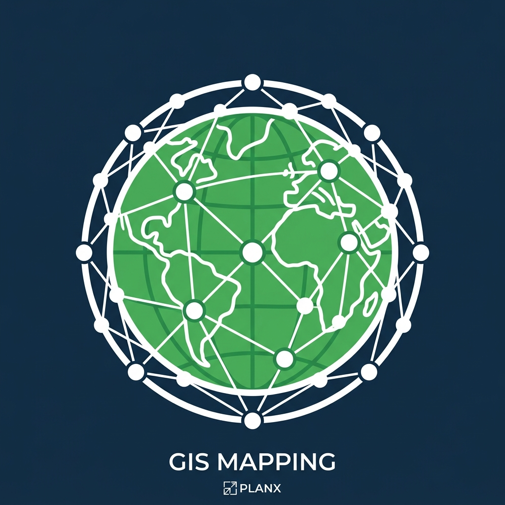
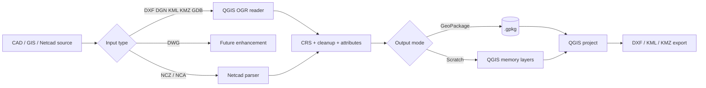

<div align="center">
  
  <h1>02gpkg</h1>
  <p><strong>CAD, KML, GDB and Netcad conversion studio for QGIS</strong></p>
  <p>
    <a href="https://plugins.qgis.org/"></a>
    
    
    
  </p>
</div>

**02gpkg** is a professional QGIS dock plugin for turning CAD and GIS exchange files into clean GeoPackage layers. It is built for planning, cadastral, municipal, and urban analytics workflows where DXF, KML/KMZ, DGN, FileGDB, and Netcad files need to become usable QGIS data quickly.

<table>
  <tr>
    <td align="center" width="33%"><br><strong>Import & Convert</strong><br>CAD/GIS files to GeoPackage or scratch layers.</td>
    <td align="center" width="33%"><br><strong>Netcad NCZ/NCA</strong><br>Batch import drawings, layers, text and tables.</td>
    <td align="center" width="33%"><br><strong>Export</strong><br>Write active QGIS vector layers to DXF, KML or KMZ.</td>
  </tr>
</table>

## What It Does

- Converts **DXF, KML, KMZ, DGN, FileGDB, NCZ and compatible NCA** files into `.gpkg` layers.
- Imports multiple Netcad drawings at once with selectable CAD layers and `@TAB` attribute tables.
- Expands KML balloon HTML tables and list descriptions into real attribute fields.
- Extracts KML/KMZ `GroundOverlay` images as georeferenced GeoTIFF layers.
- Simplifies collinear CAD vertices, removes duplicate nodes, and closes small polygon gaps by tolerance.
- Preserves CAD color intent with QGIS renderers and optional buffered labels for text elements.
- Exports active QGIS vector layers to **DXF, KML or KMZ**.
- Includes a built-in **Guide** button in the QGIS dock for workflow help.

## Supported Workflows

| Workflow | Input / Output | Engine | Best for |
| --- | --- | --- | --- |
| CAD/GIS import | `.dxf`, `.dgn`, `.kml`, `.kmz`, `.gdb` to `.gpkg` or scratch layers | QGIS GDAL/OGR | Standard exchange files and planning datasets |
| Future enhancement | `.dwg` | Planned external/newer CAD reader path | DWG versions beyond GDAL libopencad support |
| Netcad import | `.ncz`, compatible `.nca` | Built-in parser | Netcad drawings with layers, colors, labels and `@TAB` tables |
| KML overlay extraction | KML/KMZ GroundOverlay to GeoTIFF | GDAL | Georeferenced image overlays |
| QGIS export | Active vector layer to `.dxf`, `.kml`, `.kmz` | QGIS vector writer | Delivery back to CAD/GIS exchange formats |

## QGIS Dock

The plugin opens as one compact dock with three focused panels:

1. **CAD & GIS Converter**
   Select source type, source path, target GeoPackage, CRS, cleanup options, KML expansion and GroundOverlay extraction.

2. **Netcad NCZ/NCA Importer**
   Select one or more Netcad drawings, review metadata, choose CAD layers and `@TAB` tables, set closure tolerance, generate geometry metrics, apply colors/labels, and load to QGIS.

3. **CAD & GIS Exporter**
   Select a project vector layer and export it as DXF, KML or KMZ.

Use **temporary scratch layers** for quick inspection. Use **GeoPackage output** for durable deliverables.

## Conversion Flow



## Netcad Import Notes

The Netcad panel is intentionally detailed because these drawings often contain mixed geometry, text, colors and table data.

- **Batch import:** select several files; 02gpkg keeps file groups separate by default, or merges matching layer names inside geometry-type groups when **Merge geometry types** is enabled.
- **Metadata review:** version, projection text, EPSG hints, feature counts and table counts are shown before conversion.
- **Layer filtering:** uncheck unnecessary CAD layers or `@TAB` tables before import.
- **Closure tolerance:** keeps cadastral polygon creation controlled; use small values unless the drawing has known snap gaps.
- **Geometry metrics:** optional length, area and centroid fields help QA and reporting.
- **Styling:** ARGB colors and text labels can be carried into QGIS for easier review.
- **Joins:** `@TAB` tables are linked back to geometry where matching name or label fields are available.

If a file does not parse as expected, retry with cleanup disabled and inspect the raw layer selection before increasing tolerance.

## Installation

Development path in this plugin workspace:

```powershell
C:\Users\YE\PyCharmMiscProject\qgis_plugins\zero2gpkg_converter
```

Optional test environment variable:

```powershell
$env:QGIS_PLUGINPATH = "C:\Users\YE\PyCharmMiscProject\qgis_plugins"
```

Restart QGIS, then enable **02gpkg - Import and Convert CAD/KML/GDB Files** from **Plugins > Manage and Install Plugins**.

## Build and Validate

```powershell
python -m unittest zero2gpkg_converter.tests.test_e2e_converter
python packaging\validate_plugin.py zero2gpkg_converter --strict
.\packaging\Build-PluginZip.ps1 -PluginDir zero2gpkg_converter
```

The release zip is written to:

```powershell
QGIS_Plugin_Releases\zero2gpkg_converter.zip
```

## Troubleshooting

| Symptom | Likely cause | Fix |
| --- | --- | --- |
| Plugin does not appear | QGIS is not scanning this folder | Set `QGIS_PLUGINPATH` and restart QGIS. |
| DWG does not open | DWG is currently a future enhancement; this QGIS/GDAL build only exposes limited libopencad support | Convert to DXF first, then run 02gpkg. |
| KML overlay is missing | No valid `GroundOverlay` or image path | Check the KML/KMZ structure and referenced image files. |
| Netcad layers are missing | Unsupported entity block or aggressive cleanup | Retry with cleanup disabled and lower closure tolerance. |
| Hub icon is missing | Metadata icon path mismatch | Keep `icon=icons/icon.png` and package with the provided build script. |

## Ownership and License

- Developer: Yusuf Eminoglu
- Email: yusuf.eminoglu@deu.edu.tr
- Repository: <https://github.com/YusufEminoglu/zero2gpkg_converter>
- License: GNU General Public License v2.0 or later