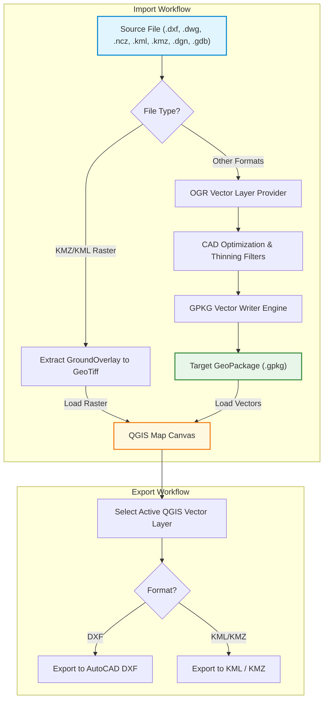

# 02gpkg: Multi-Format CAD & GIS Converter and Exporter Studio

<p align="center">
  
</p>

An advanced, high-performance bidirectional QGIS plugin designed to convert, optimize, import, and export multiple CAD and GIS drawing formats directly to and from structured OGC GeoPackage (`.gpkg`) databases. 100% English interface, fully integrated with the PlanX ecosystem.

---

## 🌟 Key Features

* **Multi-Format Processing:** Handles AutoCAD (`.dxf`, `.dwg`), Netcad (`.ncz`), Microstation (`.dgn`), Google Earth (`.kml`, *.kmz*), and ArcGIS File Geodatabase (`.gdb`) formats.
* **Bidirectional Studio (Competitor Domination):** Includes a dedicated **Exporter** tab to write active QGIS layers out to AutoCAD DXF, Google Earth KML, or KMZ files.
* **GroundOverlay Georeferencing (kmltools Feyz):** Automatically extracts ground overlay images from KMZ/KML and transforms them into georeferenced GeoTiff raster layers via GDAL coordinates.
* **HTML Balloon Expansion (kmltools Feyz):** Automatically parses HTML description tables (`<table>`, `<tr>`, `<td>`, `<li>`) from KML balloon text into structured database columns.
* **CAD Attribute Augmentation (cad_to_gis_convert Feyz):** Computes geometric metrics (length, area, centroid coords) to enrich attribute columns.
* **Direct GeoPackage Output:** Writes data straight to local sqlite-based `.gpkg` tables, avoiding unstable memory layers and slow disk reads.
* **Collinear Node Simplification:** Automatic thinning algorithm that strips unnecessary points along straight segments to reduce file weight.
* **Closed Loop Topology Builder:** Automatically closes gaps at the ends of open polylines within a customizable distance threshold to create clean polygon rings.
* **Dynamic Styling & Annotation:** Translates original CAD ARGB color matrices into QGIS outline and fill styles, and converts text symbols into buffered, readable map labels.
* **Automatic Database Joins:** Auto-detects table relations and links `@TAB` attribute databases back to geometric drawings.

---

## 🔄 Bidirectional Workflow



---

## 📊 Supported Formats Comparison

| Format | Extension | Driver Engine | CAD Optimizations | Bidirectional Export | Special Augmentations |
| :--- | :---: | :---: | :---: | :---: | :---: |
| **AutoCAD DXF** | `.dxf` | GDAL/OGR DXF | Yes | **Yes (Export Layer)** | Styling & Colors |
| **AutoCAD DWG** | `.dwg` | GDAL/OGR (requires dwg2dxf) | Yes | No | Fallback converter tips |
| **Netcad NCZ** | `.ncz` | Custom Binary Parser | Yes | No | ARGB Colors + Labels + Joins |
| **Google Earth KML**| `.kml` | GDAL/OGR KML | Yes | **Yes (Export Layer)** | Balloon HTML Expansion |
| **Google Earth KMZ**| `.kmz` | Zip Extractor + OGR KML | Yes | **Yes (Export Layer)** | GroundOverlay Georeferencing |
| **Microstation DGN**| `.dgn` | GDAL/OGR DGN | Yes | No | Layer Styling |
| **ArcGIS Database** | `.gdb` | GDAL/OGR OpenFileGDB | Yes | No | Full Attributes |

---

## 🛠️ Interface Walkthrough

The interface is accessible via the **02gpkg** toolbar button or under **PlanX > 02gpkg - CAD & GIS Converter**.

### 1. CAD & GIS Converter Tab
Designed for bulk conversions:
1. Select the **Dataset Type** from the dropdown menu.
2. Browse to select your drawing file or GDB directory.
3. Click **Save As...** to define the output `.gpkg` destination path.
4. Set the **Target CRS** (automatically defaults to project projection).
5. Tick conversion rules (simplification, GroundOverlay extraction, loading to canvas).
6. Press **Convert to GeoPackage**.

### 2. Netcad NCZ Importer Tab
Designed for custom Netcad integration:
1. Browse to select the `.ncz` binary drawing.
2. View drawing metadata (version, native projection, total features).
3. Toggle checkable items in the **CAD Layers** tree to import only selected layers.
4. Define closure tolerance in meters (spinbox).
5. Enable automated labeling, geometry calculations (Area/Length), and `@TAB` joins.
6. Press **Convert NCZ & Load to Canvas**.

### 3. CAD & GIS Exporter Tab
Designed for exporting pro datasets:
1. Select the **Source Layer** currently active in your QGIS project.
2. Choose the **Target Export Format** (DXF, KML, or KMZ).
3. Select the **Save Location** using the "Save As..." dialog.
4. Press **Export Dataset** to complete the operation.

---

## 🧪 Unit & E2E Validation Tests

The package includes a comprehensive testing module that validates parsing, collinear thinning, and balloon HTML table extraction algorithms:
```bash
# Execute tests locally
python -m unittest zero2gpkg_converter.tests.test_e2e_converter
```

---

## 📂 Installation

### Production Directory Setup
Clone or extract the repository directly to your QGIS plugin pathway:
```bash
# Path target
C:\Users\YE\PyCharmMiscProject\qgis_plugins\zero2gpkg_converter
```
Restart QGIS. Enable the plugin via **Plugins > Manage and Install Plugins...**

---

## ✍️ Ownership and License

* **Developer:** Yusuf Eminoğlu
* **Email:** yusufeminoglu@planx.com
* **Repository:** [YusufEminoglu/zero2gpkg_converter](https://github.com/YusufEminoglu/zero2gpkg_converter)
* **License:** GNU General Public License v2.0 or later (GPL-2.0-or-later)
