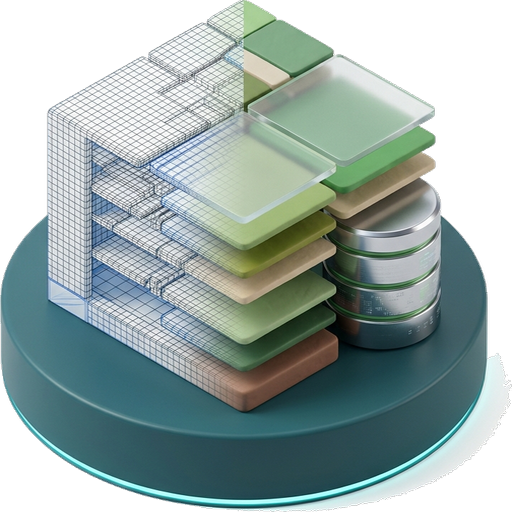
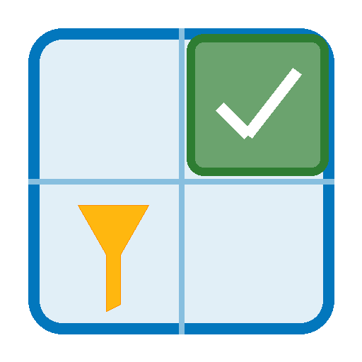
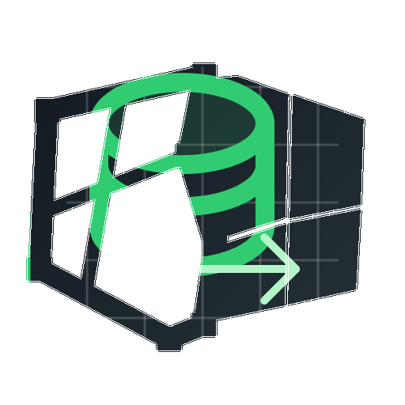
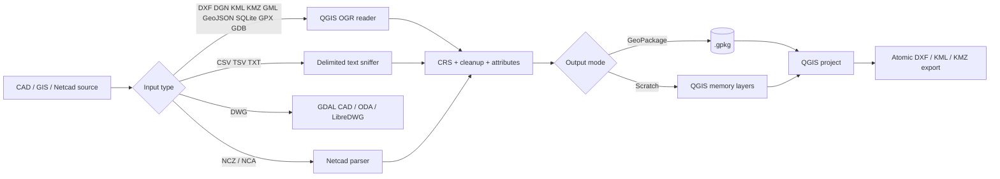

<div align="center">
  
  <h1>02CadGis</h1>
  <p><strong>AutoCAD DWG/DXF, Netcad NCZ, KML, GML, CSV, GDB, DGN conversion studio for QGIS</strong></p>
  <p>
    <a href="https://plugins.qgis.org/"></a>
    
    
    
    <br><a href="https://geophilo.com/zero2cadgis/"></a>
  </p>
  <p>
    <a href="https://geophilo.com/zero2cadgis/ZERO2CADGIS_REFERENCE_MANUAL.html"><b>📖 Comprehensive Academic Reference Manual</b></a>
  </p>
</div>

**02CadGis** is a professional QGIS dock plugin for turning CAD and GIS exchange files into clean GeoPackage layers. It is built for planning, cadastral, municipal, and urban analytics workflows where AutoCAD DWG (*.dwg), DXF, KML/KMZ, GML, GeoJSON, CSV, SpatiaLite, GPX, DGN, FileGDB, and Netcad files need to become usable QGIS data quickly.

<table>
  <tr>
    <td align="center" width="25%"><br><strong>Import & Convert</strong><br>CAD/GIS files to GeoPackage or scratch layers.</td>
    <td align="center" width="25%"><br><strong>Netcad NCZ/NCA</strong><br>Batch import drawings, layers, text and tables.</td>
    <td align="center" width="25%"><br><strong>Spatial Filter</strong><br>Scan 300+ drawings in seconds; import only extent matches.</td>
    <td align="center" width="25%"><br><strong>Export</strong><br>Write QGIS vector layers to DXF, KML, KMZ or MBTiles.</td>
  </tr>
</table>

## What It Does

- **Fast Batch Spatial Extent Filter**: Scan hundreds of CAD sheets / paftas (NCZ, DXF, DWG, DGN, SHP, KML, GDB) in 1–5 ms per file without loading layers into memory or causing QGIS to freeze/crash, filtering down to only files that match your active canvas, print layout, or selected polygon boundary. Includes interactive footprint preview on the map canvas and unified GeoPackage or folder export.
- Converts **AutoCAD DWG (*.dwg), DXF, KML, KMZ, GML, GeoJSON, CSV/TSV, SpatiaLite/SQLite, GPX, DGN, FileGDB, Personal GDB, NCZ and compatible NCA** files into `.gpkg` layers.
- Accepts **drag & drop**: drop any supported file onto the dock and the dataset type is detected automatically (Netcad files jump to the NCZ tab).
- Shows a **pre-conversion layer preview** with geometry types and feature counts, so you convert only the layers you check.
- **Caches the layer catalog** of Geodatabase and database sources by a content fingerprint, so reopening the same unchanged `.gdb`/`.mdb` lists its layers instantly (over 100x faster) without reopening the driver.
- Loads selected layers **live, with no conversion**: for FileGDB / Personal GDB (and any multi-layer OGR source) the checked layers are added straight to QGIS as zero-copy references, so even multi-million-feature Geodatabase layers open in a fraction of a second.
- **Splits DXF and DGN by CAD layer**: each CAD layer name (DXF `Layer`) or level (DGN `Level`) becomes its own selectable QGIS layer instead of a single merged table.
- Reads **every KML document inside a KMZ**, not just the first, so multi-document archives are imported in full.
- Treats KMZ as untrusted input: archive paths, entry count and expanded size
  are validated before extraction.
- Reads **delimited text with automatic geometry detection**: delimiter, X/Y or lon/lat columns (WGS84 auto-suggested), or a WKT column, all overridable before import.
- Imports multiple Netcad drawings at once with selectable CAD layers and `@TAB` attribute tables.
- Expands KML balloon HTML tables and list descriptions into real attribute fields.
- Extracts KML/KMZ `GroundOverlay` images as georeferenced GeoTIFF layers.
- Simplifies collinear CAD vertices, removes duplicate nodes, and closes small polygon gaps by tolerance.
- Preserves CAD color intent with QGIS renderers and optional buffered labels for text elements.
- **TR-Only MPYY Style for Turkish imar plans.** Each CAD layer (tabaka) of an NCZ, DXF or DWG plan is written to its MPYY 1.1.7 feature type in a MPYY workspace GeoPackage and drawn with the MPYY UİP / NİP / ÇDP styles — the Ministry's e-Plan SLDs with the Ek-1e catalogue corrections and the plan symbol fonts, carried inside the plugin (see [THIRD_PARTY_NOTICES.md](THIRD_PARTY_NOTICES.md)). Zoning values in the drawing (nizam, kat, TAKS, KAKS, setbacks, including Netcad Smart Object properties) fill the MPYY fields. Unknown layer names are only proposed, never guessed.
- Exports active QGIS vector layers and map canvases to **DXF, KML, KMZ, or Web Map Tiles (MBTiles / TMS / XYZ)**, either for individual layers or the entire active project canvas. Features automated Web Mercator (EPSG:3857) reprojection, configurable zoom pyramids, PNG transparency, and 1-click Netcad-to-MBTiles workflow. Atomic publishing protects existing deliverables from interrupted writes.
- Publishes imported GeoPackages transactionally as well: all selected layers
  must finish before the existing destination is replaced.
- Produces a copy-ready **conversion receipt** with source, destination, mode,
  CRS, layer geometry, feature totals and warnings for QA and delivery records.
- Includes a built-in **Guide** button in the QGIS dock for workflow help.

## Supported Workflows

| Workflow | Input / Output | Engine | Best for |
| --- | --- | --- | --- |
| CAD/GIS import | `.dxf`, `.dgn`, `.kml`, `.kmz`, `.gml`, `.geojson`, `.sqlite`, `.gpx`, `.gdb`, `.mdb` to `.gpkg` or scratch layers | QGIS GDAL/OGR | Standard exchange files and planning datasets |
| Delimited text import | `.csv`, `.tsv`, `.txt` with auto-detected X/Y or WKT geometry | QGIS delimited text provider | Survey point lists, exports from spreadsheets and databases |
| AutoCAD DWG import | `.dwg` to `.gpkg`, scratch or live layers | GDAL CAD plus optional ODA/LibreDWG assistance | Legacy and modern AutoCAD drawings |
| Netcad import | `.ncz`, compatible `.nca` | Built-in parser | Netcad drawings with layers, colors, labels and `@TAB` tables |
| KML overlay extraction | KML/KMZ GroundOverlay to GeoTIFF | GDAL | Georeferenced image overlays |
| QGIS export | Full layer or selected features to `.dxf`, `.kml`, `.kmz` | Atomic QGIS vector writer with explicit CRS handling | Verified CAD/GIS delivery without partial-file replacement |

## QGIS Dock

The plugin opens as one compact dock with three focused panels:

1. **CAD & GIS Converter**
   Select source type (or drop a file), review the discovered layer list, set target GeoPackage, CRS, cleanup options, KML expansion, GroundOverlay extraction, and delimited-text geometry columns. A target GPKG name is pre-suggested from the source file, options persist across sessions, and results are announced in the QGIS message bar without blocking dialogs. Pick one of three **output modes**: convert to **GeoPackage** (durable, transformed), import as **temporary scratch** layers, or **live** — add the checked layers with no conversion at all, ideal for browsing large FileGDB / Personal GDB databases. DXF/DGN sources can be **split into their CAD layers** for selection, and the Geodatabase/database layer catalog is cached for instant reopening.

2. **Netcad NCZ/NCA Importer**
   Select one or more Netcad drawings, review metadata, choose CAD layers and `@TAB` tables, set closure tolerance, generate geometry metrics, apply colors/labels, and load to QGIS.

3. **CAD & GIS Exporter**
   Select a project vector layer, choose the complete layer or its current
   feature selection, and export to DXF, KML or KMZ. DXF exposes its delivery
   CRS; KML/KMZ is locked to WGS 84 for correct Google Earth positioning. The
   writer validates its temporary output before atomically publishing the
   final file, then reports the exported feature count, CRS and file size.

Every completed import also opens a **Last Conversion Receipt** card. Copy it
directly into a project log, delivery note or QA report; it records exactly what
was loaded or written rather than relying on a transient message-bar notice.

Use **temporary scratch layers** for quick inspection. Use **GeoPackage output** for durable deliverables.

## Conversion Flow


```mermaid
flowchart LR
  A[CAD / GIS / Netcad source] --> B{Input type}
  B -->|DXF DGN KML KMZ GML GeoJSON SQLite GPX GDB| C[QGIS OGR reader]
  B -->|CSV TSV TXT| T[Delimited text sniffer]
  B -->|DWG| X[GDAL CAD / ODA / LibreDWG]
  B -->|NCZ / NCA| D[Netcad parser]
  C --> E[CRS + cleanup + attributes]
  T --> E
  D --> E
  E --> F{Output mode}
  F -->|GeoPackage| G[(.gpkg)]
  F -->|Scratch| H[QGIS memory layers]
  G --> I[QGIS project]
  H --> I
  I --> J[Atomic DXF / KML / KMZ export]
```

## Netcad Import Notes

The Netcad panel is intentionally detailed because these drawings often contain mixed geometry, text, colors and table data.

- **Fast selection, selective decode:** choosing a drawing only indexes its
  layers and metadata, so the layer tree appears almost immediately even for
  large municipal files; geometry is decoded only for the layers you keep
  checked at import time.
- **Index cache:** the layer catalog of each drawing is cached locally and
  keyed to the file's size and modification time, so reopening an unchanged
  drawing is near-instant. The cache rebuilds automatically when a file
  changes; use **Clear cache** on the Netcad tab to reset it manually.
- **Batch import:** select several files; 02CadGis keeps file groups separate by default, or merges matching layer names inside geometry-type groups when **Merge geometry types** is enabled.
- **Automatic CRS detection:** a Netcad drawing stores its own SRS id, not an
  EPSG code, so 02CadGis works the EPSG out from the drawing's projection text
  plus a sample of its coordinates and preselects it. The Turkish 3-degree
  families are covered — TUREF and ED50, in both the TM form and the
  zone-prefixed Gauss-Krüger form — along with the UTM zones over Turkey. The
  panel shows which CRS was chosen and why, and the choice is only a
  preselection: change it and your choice is what gets used. When the drawing
  does not say enough to name a CRS with confidence, 02CadGis says so and
  leaves the selection to you rather than guessing, since a wrong CRS silently
  puts the data in the wrong place. The chosen CRS is what the layers are drawn
  in and what a written GeoPackage carries.
- **Metadata review:** version, projection text, EPSG hints, feature counts and table counts are shown before conversion.
- **Layer filtering:** uncheck unnecessary CAD layers or `@TAB` tables before import.
- **Closure tolerance:** keeps cadastral polygon creation controlled; use small values unless the drawing has known snap gaps.
- **Geometry metrics:** optional length, area and centroid fields help QA and reporting.
- **Styling:** ARGB colors and text labels can be carried into QGIS for easier review.
- **Joins:** `@TAB` tables are linked back to geometry where matching name or label fields are available.

#### TR-Only MPYY Style (Turkish imar plans)

**TR-Only MPYY Style is off by default and should stay off for non-planning
drawings** — topographic surveys, utility networks, cadastral and civil
engineering files keep their raw layer names, their CAD attributes and their
original ARGB colors.

Turn it on for an imar plan (NCZ tab, or DXF / DWG in the converter) and 02CadGis will:

- create a **MPYY 1.1.7 workspace GeoPackage** for the plan level and write each
  CAD layer (tabaka) into its MPYY feature type with its code values —
  `PL_KONUT` becomes `Konut` with `KonutTip = YerlesikKonut`;
- resolve layer names **exactly**, by a **mapping you confirmed before**, or by a
  **spelling rule that cannot change the meaning** (a copy number, a Netcad
  export suffix, the `_ALANI` ending, a `PL_` prefix). Anything else is only
  *proposed* in a confirmation table, ranked word by word against the
  Ek-1e function names and MPYY codes; you tick what is right or type to pick
  any function by hand, and confirmed mappings are remembered;
- carry the drawing's **zoning values** — nizam, kat, TAKS, KAKS / emsal,
  Hmax, setbacks, read from notation texts and from Netcad 8 Smart Object
  properties — into the MPYY fields, but only values the MPYY form accepts;
- draw the MPYY layers with the **MPYY UİP / NİP / ÇDP styles**, at the plan's
  reference scale (1:1000 / 1:5000 / 1:25000) so symbols and texts zoom like
  the printed sheet, with area pictograms at the regulated 10 / 7 / 5 mm, and a
  legend that lists only the values the plan uses;
- draw the drawing's own **plan notation** where the planner placed it: every
  Netcad 8 building-rights and road-width Smart Object becomes a point in
  `<file>_PLAN_NOTATION` — "Building notation" (nizam / kat circle, TAKS / KAKS
  circle, E =, Yençok) and "Road widths" (the width in a circle), drawn with the
  Ek-1e notation. The plan areas keep the values, and their own notation labels
  are switched off then, so nothing is drawn twice;
- keep every layer that has no MPYY type, and every feature whose geometry does
  not fit its type (texts, open lines), in a separate group in the drawing's own
  ARGB colors. The ARGB option is locked on in this mode for that reason.

Lines keep the **drawing's own pen**: Netcad stores a pen width in mm per layer
(for example yapı yaklaşma 1.0, parsel 0.3), and CAD layers are drawn at it —
0.25 mm where a layer sets none. Önerilen / korunan / düzeltilen cephe take
their width from `CizgiKalinligi`, filled from the drawing's pen.

The **plan level** selector picks UİP, NİP or ÇDP. *Auto* reads the scale from
the file name — `1000_…` implementation plan (UİP), `5000_…` master plan (NİP),
`25000` and above environmental plan (ÇDP). Choose the level explicitly when
the file name says nothing.

#### Layer selection, columns and the three-layer import

- **Filter** the layer list by name or geometry: every word must match, and
  `LINE`, `POLYGON`, `POINT` or `TEXT` keep the layers holding that geometry
  (`PL_ line`). Turkish letters are matched loosely (ı / i / İ / I, ş / s …).
  Select All / Deselect All act on the listed layers only.
- **Attribute columns** (NCZ tab and converter): untick the columns you do not
  want written. Columns the styles, labels and MPYY transfer read are locked.
- **Merge all layers into 3 layers** writes every tabaka into one polygon, one
  line and one point/text layer. The style is categorized by `layer_name`, so
  every tabaka keeps its own drawing color; helper and pen layers are listed but
  switched off.

If a file does not parse as expected, retry with cleanup disabled and inspect the raw layer selection before increasing tolerance.

### NCZ Engine Provenance

02CadGis reads Netcad NCZ/NCA drawings with its **v2 engine**
(`core/ncz_engine/v2/`), an independent, block-oriented decoder written
against the documented format layout in [docs/NCZ_FORMAT.md](docs/NCZ_FORMAT.md)
rather than by adapting upstream source line by line. Because that format
knowledge ultimately traces back to
[Jeomatik NCZ Reader](https://github.com/erdincunal/Jeomatik-NCZ-Reader),
Copyright (C) 2026 Erdinç Örsan ÜNAL, under GPL-2.0-or-later, the upstream
copyright, source link, and license are retained in
[THIRD_PARTY_NOTICES.md](THIRD_PARTY_NOTICES.md). The legacy v1 decoder is
kept as a validated reference and safety fallback; the v2 engine is verified
to produce byte-identical output to it across the synthetic NCZ corpus in
`tests/`. The engine architecture and roadmap are in
[docs/NCZ_ENGINE_V2.md](docs/NCZ_ENGINE_V2.md).

02CadGis is an independent project and is not endorsed by or affiliated
with Jeomatik.

## Installation

Development path in this plugin workspace:

```powershell
C:\Users\YE\PyCharmMiscProject\qgis_plugins\zero2cadgis
```

Optional test environment variable:

```powershell
$env:QGIS_PLUGINPATH = "C:\Users\YE\PyCharmMiscProject\qgis_plugins"
```

Restart QGIS, then enable **02CadGis Universal CAD/GIS Importer** from **Plugins > Manage and Install Plugins**.

## Build and Validate

```powershell
python -m unittest zero2cadgis.tests.test_e2e_converter
python packaging\validate_plugin.py zero2cadgis --strict
.\packaging\Build-PluginZip.ps1 -PluginDir zero2cadgis
```

The release zip is written to:

```powershell
QGIS_Plugin_Releases\zero2cadgis.zip
```

## Troubleshooting

| Symptom | Likely cause | Fix |
| --- | --- | --- |
| Plugin does not appear | QGIS is not scanning this folder | Set `QGIS_PLUGINPATH` and restart QGIS. |
| DWG does not open | DWG is currently a future enhancement; this QGIS/GDAL build only exposes limited libopencad support | Convert to DXF first, then run 02CadGis. |
| KML overlay is missing | No valid `GroundOverlay` or image path | Check the KML/KMZ structure and referenced image files. |
| Netcad layers are missing | Unsupported entity block or aggressive cleanup | Retry with cleanup disabled and lower closure tolerance. |
| Hub icon is missing | Metadata icon path mismatch | Keep `icon=icons/icon.png` and package with the provided build script. |

## Ownership and License

- 02CadGis developer and maintainer: Yusuf Eminoğlu
- Email: yusuf.eminoglu@deu.edu.tr
- Repository: <https://gitlab.com/geophilo1/zero2cadgis>
- License: GNU General Public License v2.0 or later
- Third-party code: see [THIRD_PARTY_NOTICES.md](THIRD_PARTY_NOTICES.md)
